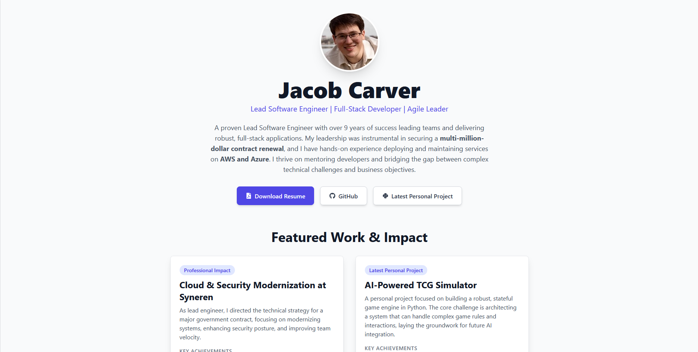

# Jacob Carver - Personal Portfolio Website



Welcome to the GitHub repository for my personal portfolio website. This site was built from the ground up to serve as a dynamic, modern resume and a showcase of my skills as a Lead Software Engineer. The primary goal is to provide a comprehensive overview of my professional experience, technical capabilities, and key achievements for potential employers.

**Live Site:** [**https://jacobcarver.dev**](https://jacobcarver.dev)
---

## ✨ Key Features

This portfolio is a single-page application built with React, designed to be both visually appealing and highly informative.

-   **Impact-Driven Summary:** A professional introduction that immediately highlights key accomplishments, such as leading efforts on a multi-million-dollar contract renewal.
-   **Featured Work Section:** Detailed cards showcasing both professional impact and personal projects, framed around problems, actions, and quantifiable results.
-   **Visual Career Journey:** An interactive timeline that illustrates my career progression from a developer to a technical lead.
-   **Categorized Tech Stack:** A clean, skimmable overview of my core competencies, from languages and databases to cloud and DevOps tooling.
-   **Responsive Design:** Fully responsive layout built with Tailwind CSS, ensuring a great experience on any device.

---

## 🛠️ Technology Stack

This project was built using a modern frontend stack, focusing on performance, developer experience, and maintainability.

-   **Frontend:** [React](https://react.dev/) (with Hooks), [Vite](https://vitejs.dev/)
-   **Styling:** [Tailwind CSS](https://tailwindcss.com/)
-   **Icons:** [React Icons](https://react-icons.github.io/react-icons/)
-   **Linting & Code Quality:** [ESLint](https://eslint.org/), [Prettier](https://prettier.io/), [depcheck](https://github.com/depcheck/depcheck)
-   **Deployment:** Vercel

---

## 🚀 Running the Project Locally

To get a local copy up and running, follow these simple steps.

### Prerequisites

You will need [Node.js](https://nodejs.org/) (version 18 or higher) and [npm](https://www.npmjs.com/) installed on your machine.

### Installation & Setup

1.  **Clone the repository:**
    ```sh
    git clone https://github.com/carve084/jacob-carver-site.git
    ```

2.  **Navigate to the project directory:**
    ```sh
    cd jacob-carver-site
    ```

3.  **Install the dependencies:**
    ```sh
    npm install
    ```

4.  **Start the development server:**
    ```sh
    npm run dev
    ```

The site will now be running on `http://localhost:5173` (or the next available port).

---

## 🌱 Future Improvements

This portfolio is a living project. Potential future enhancements include:

-   Fleshing out the AI component of the TCG simulator project and linking to a live demo.
-   Adding a simple blog section to write about technical challenges and solutions.
-   Implementing a CI/CD pipeline for automated testing and deployment.

---

## 📄 License

This project is licensed under the MIT License. See the `LICENSE` file for details.